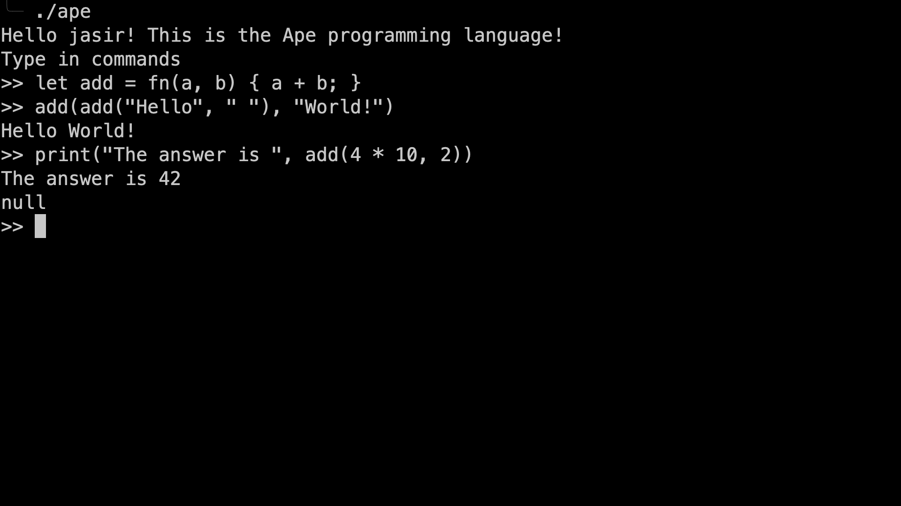

# Ape Lang

C like, interpreted language written in Go. Based on [Monkey Lang](https://monkeylang.org/)
from the book [Writing an Interpreter in Go](https://interpreterbook.com/)
with various changes and additions, and an in browser playground with the interpreter
compiled to WASM.

Try it out [here](https://zaeem.dev/ape) zaeem.dev/ape in the web playground with a syntax highlighted editor, ast
viewer, interactive repl and a code formatter.


*In browser playground*

Or compile it yourself and run the repl locally.

```bash
# Clone the repo
git clone https://github.com/JasirZaeem/ape.git
cd ape
# Build
make repl
# Run
./ape
```


*Repl*

Or run the wasm playground locally.

```bash
# Clone the repo
git clone https://github.com/JasirZaeem/ape.git
cd ape
# Build the wasm interpreter
make wasm
# Enter the playground directory
cd playground
# Install dependencies
yarn
# Start the dev server
yarn dev
```
And visit the url shown by vite in the terminal.

## The Language

C like and based around expressions. Check out some examples, more examples are available in the playground.

#### Hello World

```ape
print("Hello World!");
```

#### Fibonacci

```ape
let fib = fn(x) {
    if (x < 2) {
        x;
    } else {
        fib(x - 1) + fib(x - 2);
    }
};

print(fib(10));
```

#### Map

```ape
let map = fn(arr, f) {
  let iter = fn(arr, accumulated) {
    if (len(arr) == 0) {
      accumulated;
    } else {
      iter(rest(arr), push(accumulated, f(first(arr))));
    };
  };

  iter(arr, []);
};

let a = [1, 2, 3, 4];
let double = fn(x) { x * 2; };

print(map(a, double));
```

#### Pop count (Hamming Weight)

```ape
let pop_count = fn(n) {
  let count = 0;
  while (n != 0) {
    count = count + 1;
    n = n & (n - 1);
  };
  return count;
};

print(pop_count(6148914691236517205));
```

### Data Types

| Type     | Examples                     | Convert       | Check              | Note                                                                                                  |
|----------|------------------------------|---------------|--------------------|-------------------------------------------------------------------------------------------------------|
| Integer  | `2, -23423, 9999999`         | `int(...)`    | `is_int(...)`      | 64 bit signed integer                                                                                 |
| Float    | `3.14159, -2.718282`         | `float(...)`  | `is_float(...)`    | 64 bit IEE 754 floating point                                                                         |
| Boolean  | `true, false`                | `bool(...)`   | `is_bool(...)`     |                                                                                                       |
| Null     | `Null`                       |               | `is_null(...)`     | The billion dollar mistake                                                                            |
| String   | `"a string", "new\nline" `   | `string(...)` | `is_string(...)`   | Array of bytes internally, no special utf-8 support                                                   |
| Function | `fn (a, b) {a + b;}`         |               | `is_function(...)` |                                                                                                       |
| Array    | `[1, "two", fn ()..]`        | `array(...)`  | `is_array(...)`    | Immutable, elements can be of any type. Only string can be converted; into array of length 1 strings. |
| Hash     | `{"key": "value", 2: "two"}` |               | `is_hash(...)`     | Immutable, Keys can be of any type.                                                                   |

### Operators

| Op                 | Examples              | Supported Types           | Notes                                                                                                       |
|--------------------|-----------------------|---------------------------|-------------------------------------------------------------------------------------------------------------|
| `+`                | `1 + 1, "a " + "b"`   | Integer, Float, String    | Not allowed to mix types, e.g. to add int to a float, convert int to float first.                           |
| `-`                | `32 - 31, 2.4 - 2.3`  | Integer, Float            | Not allowed to mix types.                                                                                   |
| `*`                | `42 * 24, 3.14 * 2.7` | Integer, Float            | Not allowed to mix types.                                                                                   |
| `/`                | `42 / 24, 3.14 / 2.7` | Integer, Float            | Not allowed to mix types.                                                                                   |
| `%`                | `42 % 24, 3.14 % 2.7` | Integer, Float            | Not allowed to mix types.                                                                                   |
| `**`               | `2 ** 4, 3.14 ** 2.7` | Integer, Float            | Exponentiation                                                                                              |
| `//`               | `5 // 2, 4.5 // 2.0`  | Integer, Float            | Floored Division, for integers behaves similarly to `/`                                                     |
| Prefix `+` and `-` | `-2, + 3.4`           | Integer, Float            |                                                                                                             |
| `=`                | `a = 23`              | Identifier = Any Type Val | Return the assigned value. Fails if identifier not already in scope.                                        |
| Prefix `~`         | `~123`                | Integer                   | Bitwise NOT                                                                                                 |
| `<<`               | `4 << 2`              | Integer                   | Bitwise left shift                                                                                          |
| `>>`               | `4 >> 2`              | Integer                   | Bitwise right shift                                                                                         |
| `&`                | `4 & 2`               | Integer                   | Bitwise AND                                                                                                 |
| `^`                | `4 ^ 2`               | Integer                   | Bitwise XOR                                                                                                 |
| `\|`               | `4 \| 2`              | Integer                   | Bitwise OR                                                                                                  |
| `<, >, <=, =>`     | `4 < 2, "zz" >= "za"` | Integer, Float, String    | Not allowed to mix types.                                                                                   |
| `==, !=`           | `4 == 2, "a" != "b"`  | All types                 |                                                                                                             |
| `&&`               | `"as" && [1]`         | All types                 | Evaluates to value on left if it is false (right expression is not evaluated). Else the value on the right. |
| `\|\|`             | `"as" \|\| "[1]"`     | All types                 | Evaluates to value on left if it is true (right expression is not evaluated). Else the value on the right.  |
| Prefix `!`         | `!0, ![], !"qwe"`     | All types                 | Logical not, returns false if value is truthy, else true.                                                   |

### Expressions and Statements

#### Let Statement

Creates a new variable in the current scope. Overwrites any existing variable with the same name in the immediate scope.

```ape
let a = 1;
let b = 2.3;
```

#### Return Statement

Ends execution of the current function and returns the value of the expression.
Can be used to return early from a function. Breaks out of if and while expressions.

```ape
let a = fn() {
    return 1;
    2;
};
```

#### If Expression

Evaluates the condition and executes the first block if the condition is true, else executes the second block if it
exists.
Evaluates to the last expression in the executed block.

```ape
if (1 < 2) {
    print("1 is less than 2");
} else {
    print("1 is not less than 2");
};

let is_two_greater = if (2 > 1) {
    true;
} else {
    false;
};
```

#### While Expression

Evaluates the condition and executes the block if the condition is true. Repeats until the condition is false,
encounters
a return or an error. Evaluates to the last expression in the executed block the last time the block is executed.

```ape
let i = 0;
let last_i = while (i < 10) {
    print(i);
    i = i + 1;
};
```

#### Function Expression

Creates and returns a new function.

```ape
fn(a, b) {
    a + b;
}(1, 2);

let add = fn(a, b) {
    a + b;
};

add(1, 2);
```

#### Literal Expressions

Create literal values of various types.

```ape
1;
3.14;
"a string";
true;
fn(a, b) {a + b;};
[1, 2, 3];
{"key": "value", 2: "two"};
```

### Features

#### Data Structures

##### String

A string is a sequence of characters. Strings are immutable.

```ape
let a = "a string";
```

##### Array

An array is an ordered collection of values. Arrays are mutable.
`[ <expression>, <expression>, ... ]`

```ape
let a = [1, 2, 3];
```

##### Hash

A hash is an unordered collection of key-value pairs. Keys can be any type, values can be any type. Hashes are immmutable.
`{ <expression>: <expression>, <expression>: <expression>, ... }`

```ape
let a = {"key": "value", 2: "two"};
```

#### First Class Functions

Functions are values and can be passed around like any other value.

```ape
let add = fn(a, b) {
    a + b;
};

let apply = fn(f, a, b) {
    f(a, b);
};

apply(add, 1, 2);
```

#### Closures

Functions can access variables in the scope they are defined in.

```ape
let make_adder = fn(a) {
    fn(b) {
        a + b;
    };
};

let add_one = make_adder(1);
add_one(2);
```

#### Higher Order Functions

Functions can take other functions as arguments and return functions.

```ape
let create_filter = fn(f) {
  fn(arr) {
    let filtered = [];
    let i = 0;
    while (i < len(arr)) {
      if (f(arr[i])) {
        filtered = push(filtered, arr[i]);
      };
      i = i + 1;
    };
    filtered;
  };
};

let is_even = fn(n) {
  n % 2 == 0;
};

let filter_even = create_filter(is_even);

filter_even([1, 2, 3, 4, 5, 6, 7, 8, 9, 10]);
```

### Built-in Functions

#### print

Prints the value of the expression to the console.

```ape
print("Hello World");
```

#### Type Utility Functions

See [Types](#Data-Types) for more information on types.

Provides functions to check value types and convert between types where possible.

```ape
is_int(1) == true;
is_float(3.14) == true;
is_string("a string") == true;
is_bool(true) == true;
is_function(fn(a, b) {a + b;}) == true;
is_array([1, 2, 3]) == true;
is_hash({"key": "value", 2: "two"}) == true;

type(1) == "INTEGER";
type(3.14) == "FLOAT";
type("a string") == "STRING";
type(true) == "BOOLEAN";
type(fn(a, b) {a + b;}) == "FUNCTION";
type([1, 2, 3]) == "ARRAY";
type({"key": "value", 2: "two"}) == "HASH";

int(3) == 3;
int(3.14) == 3;
int("3") == 3;
int(true) == 1;
int(false) == 0;

float(3) == 3.0;
float(3.14) == 3.14;
float("3.14") == 3.14;
float(true) == 1.0;
float(false) == 0.0;

string(3) == "3";
string(3.14) == "3.14";
string("3.14") == "3.14";
string(true) == "true";
string(false) == "false";
string(fn(a, b) {a + b;}) == "fn(a, b) {
(a + b)
}";
string([1, 2, 3]) == "[1, 2, 3]";
string({"key": "value", 2: "two"}) == "{\"key\": \"value\", 2: \"two\"}";

bool(3) == true;
bool(0) == false;
bool(3.14) == true;
bool("3.14") == true;
bool(true) == true;
bool(false) == false;
bool(fn(a, b) {a + b;}) == true;
bool([1, 2, 3]) == true;
bool({"key": "value", 2: "two"}) == true;

array([1, 2, 3]) == [1, 2, 3];
array("abc") == ["a", "b", "c"];
```

#### Array and String Functions

As strings are also array of bytes, these functions are also implemented for strings.
Where individual bytes/ascii character in the interpreter, or string of length 1 in ape)
act as element of an ape array.

Since ape data structures are immutable, these functions do not modify the original array/string, but return a new one.

| Function     | Example                                            | Description                                                                                                                                                                |
|--------------|----------------------------------------------------|----------------------------------------------------------------------------------------------------------------------------------------------------------------------------|
| `first`      | `first([1, 2, 3]); first("abc")`                   | Returns the first array element/first string character. Null if empty.                                                                                                     |
| `last`       | `last([1, 2, 3]); last("abc")`                     | Returns the last array element/first string character. Null if empty.                                                                                                      |
| `rest`       | `rest([1, 2, 3]); rest("abc")`                     | Returns the array without the first element/string without the first character. Null if length less than 2.                                                                |
| `init`       | `init([1, 2, 3]); init("abc")`                     | Returns the array without the last element/string without the last character. Null if length less than 2.                                                                  |
| `at`         | `at([1, 2, 3], 1); at("abc", 1)`                   | Returns the element at the given index. Null if index out of bounds. Index can be negative to count from the end.                                                          |
| `set`        | `set([1, 2, 3], 1, 4); set("abc", 1, "d")`         | Returns a new array/string with the element/character at the given index set to the given value. Null if index out of bounds. Index can be negative to count from the end. |
| `push`       | `push([1, 2, 3], 4); push("abc", "d")`             | Returns a new array/string with the given element/character appended.                                                                                                      |
| `pop`        | `pop([1, 2, 3]); pop("abc")`                       | Returns a new array/string with the last element/character removed. Null if empty.                                                                                         |
| `push_front` | `push_front([1, 2, 3], 4); push_front("abc", "d")` | Returns a new array/string with the given element/character prepended.                                                                                                     |
| `pop_front`  | `pop_front([1, 2, 3]); pop_front("abc")`           | Returns a new array/string with the first element/character removed. Null if empty.                                                                                        |
| `insert`     | `insert([1, 2, 3], 1, 4); insert("abc", 1, "d")`   | Returns a new array/string with the given element/character inserted at the given index. Null if index out of bounds. Index can be negative to count from the end.         |
| `remove`     | `remove([1, 2, 3], 1); remove("abc", 1)`           | Returns a new array/string with the element/character at the given index removed. Null if index out of bounds. Index can be negative to count from the end.                |
| `reverse`    | `reverse([1, 2, 3]); reverse("abc")`               | Returns a new array/string with the elements/characters in reverse order.                                                                                                  |
| `len`        | `len([1, 2, 3]); len("abc")`                       | Returns the length of the array/string.                                                                                                                                    |

#### Hash Functions

| Function  | Example                                       | Description                                                                        |
|-----------|-----------------------------------------------|------------------------------------------------------------------------------------|
| `keys`    | `keys({"key": "value", 2: "two"})`            | Returns an array of the hash keys.                                                 |
| `values`  | `values({"key": "value", 2: "two"})`          | Returns an array of the hash values.                                               |
| `entries` | `entries({"key": "value", 2: "two"})`         | Returns an array of the hash entries. Each entry is an array of the key and value. |
| `has_key` | `has_key({"key": "value", 2: "two"}, 2)`      | Returns true if the hash contains the given key.                                   |
| `set`     | `set({"key": "value", 2: "two"}, 2, "three")` | Returns a new hash with the given key set to the given value.                      |
| `delete`  | `delete({"key": "value", 2: "two"}, 2)`       | Returns a new hash with the given key removed.                                     |
| `len`     | `len({"key": "value", 2: "two"})`             | Returns the number of entries in the hash.                                         |

#### String Functions

| Function     | Example                      | Description                                                                                                                        |
|--------------|------------------------------|------------------------------------------------------------------------------------------------------------------------------------|
| `char`       | `char(65)`                   | Returns the ascii character for the given ascii code.                                                                              |
| `ascii`      | `ascii("A")`                 | Returns the ascii code for the given ascii character.                                                                              |
| `split`      | `split("a,b,c", ",")`        | Returns an array of strings split by the given separator. If separator is empty, returns an array of the characters in the string. |
| `split_once` | `split_once("a,b,c", ",")`   | Returns an array of strings split by the given separator at most once.                                                             |
| `join`       | `join(["a", "b", "c"], ",")` | Returns a string of the array elements joined by the given separator.                                                              |


